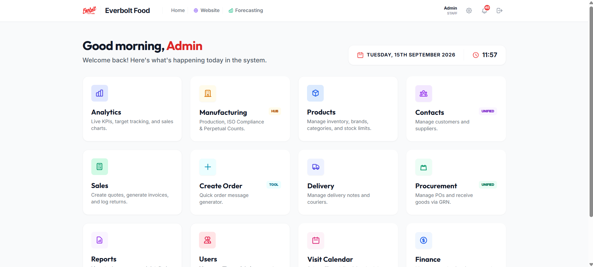
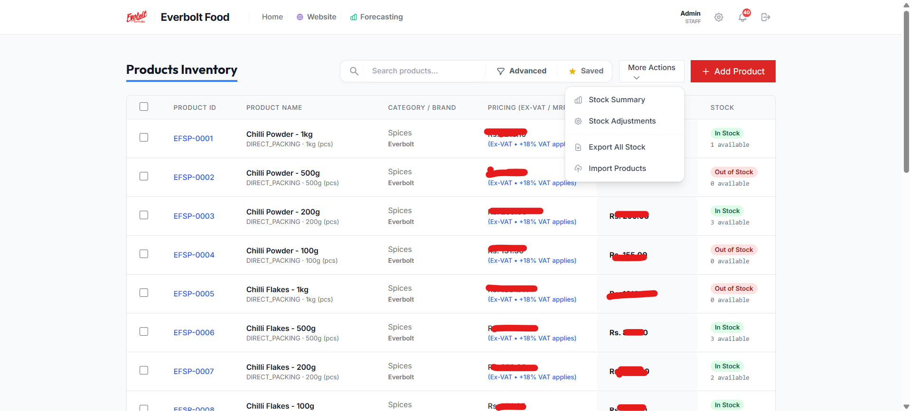
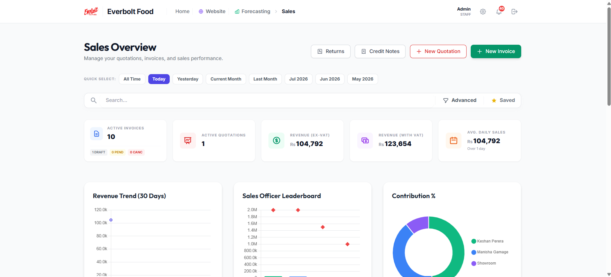
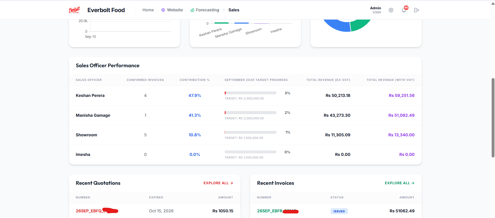
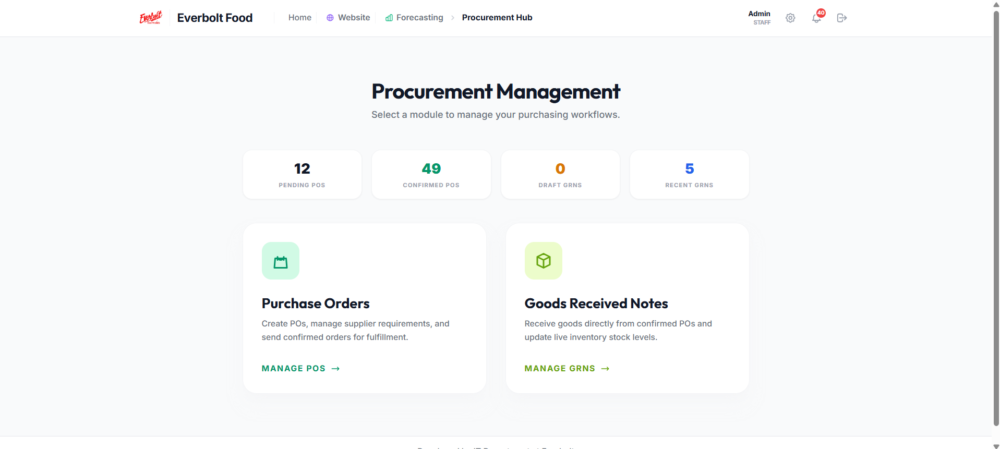
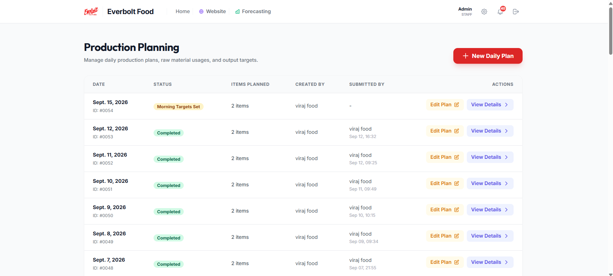
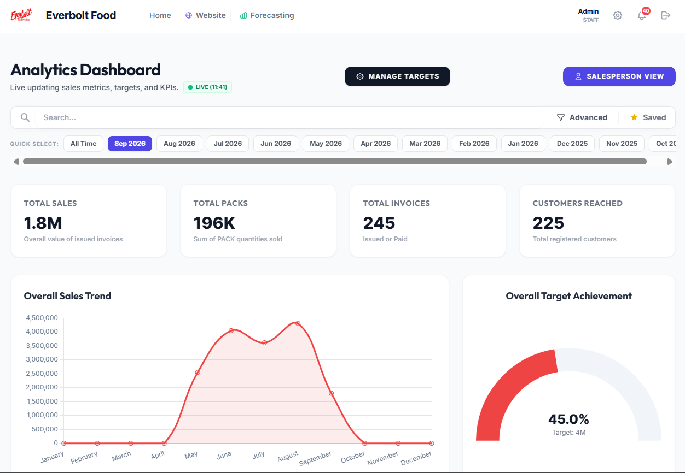
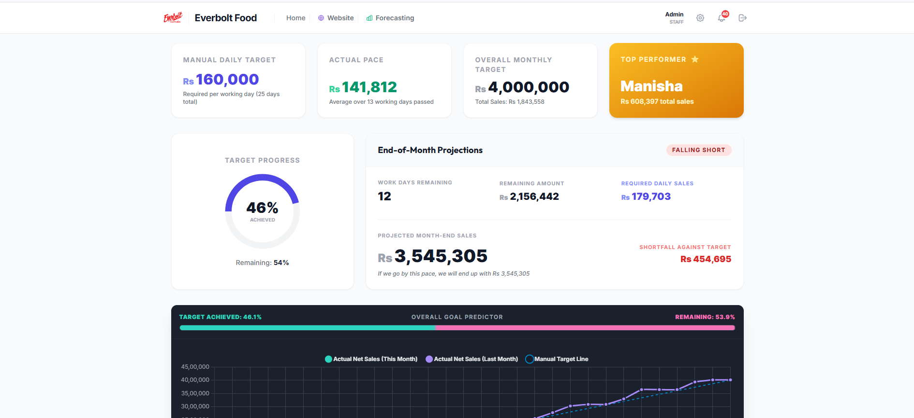

# Django ERP & Business Automation Case Study

A production-inspired ERP case study demonstrating how I designed and developed business workflows using **Python, Django, PostgreSQL, JavaScript, Bootstrap, HTML, and CSS**.

> This repository is a technical showcase based on my commercial ERP development experience.  
> The original production source code, company data, credentials, and proprietary business logic are private.

---

## 👨‍💻 My Role

**Full-Stack / Django Software Engineer**

I worked across the full development lifecycle, including:

- Business requirement analysis
- Database and model design
- Django backend development
- Frontend development
- Business workflow automation
- User roles and access control
- Reporting and dashboards
- Deployment and maintenance
- Direct communication with business users and management

The system was developed to replace several manual and disconnected operational processes with a centralized business platform.

---

## 🎯 Business Problem

The organization handled important operations across multiple manual processes, spreadsheets, documents, and separate systems.

This created challenges such as:

- Limited visibility of inventory movements
- Manual quotation and invoice handling
- Difficulty tracking purchasing activities
- Disconnected production records
- Limited management reporting
- Repetitive manual data entry
- Difficulty retrieving historical transactions
- Lack of centralized customer and supplier information

The objective was to build a centralized ERP platform that could support daily business operations through structured digital workflows.

---

## 🏗️ Solution

I developed a modular Django-based ERP platform covering major business functions such as:

- CRM
- Customer management
- Supplier management
- Inventory
- Sales
- Procurement
- Manufacturing
- Finance-related workflows
- Deliveries
- User management
- Dashboards and reporting

The application was structured using multiple Django apps so that individual business modules could be maintained and expanded independently.

---

# 🧩 Major Modules

## 1. CRM & Customer Management

The CRM module centralizes customer-related information and sales activities.

Key functions include:

- Customer records
- Contact information
- Sales activity tracking
- Customer transaction history
- Internal customer management workflows

---

## 2. Inventory Management

The inventory module provides visibility and control over stock movements.

Features include:

- Product master data
- Product categories
- Brands
- Units of measurement
- Stock-in transactions
- Stock-out transactions
- Stock adjustments
- Stock ledger
- Inventory history
- Product pricing
- Media and product image management

The stock ledger maintains an audit-friendly history of inventory movements.

---

## 3. Sales Management

The sales workflow supports the process from quotation through invoicing and delivery.

Typical workflow:

```text
Customer
   ↓
Quotation
   ↓
Sales Order
   ↓
Invoice
   ↓
Payment Status
   ↓
Delivery
```

Functions include:

- Quotations
- Invoice generation
- Automated total calculations
- Customer transaction history
- Payment status tracking
- Delivery records
- Historical transaction retrieval

---

## 4. Procurement

The procurement module supports purchasing operations and incoming inventory.

Typical workflow:

```text
Purchase Requirement
        ↓
Purchase Order
        ↓
Supplier
        ↓
Goods Receipt / GRN
        ↓
Stock Update
```

Functions include:

- Supplier management
- Purchase orders
- Pending receipts
- Goods Received Notes (GRN)
- Purchasing history
- Inventory updates

---

## 5. Manufacturing & Production

The production module helps manage manufacturing and repacking activities.

Functions include:

- Production planning
- Production orders
- Raw-material consumption
- Finished-goods output
- Wastage tracking
- Production records

Example workflow:

```text
Production Plan
      ↓
Production Order
      ↓
Raw Materials
      ↓
Production
      ↓
Finished Goods
      ↓
Inventory Update
```

---

## 6. Delivery Management

The delivery workflow connects sales transactions with customer deliveries.

Functions include:

- Delivery notes
- Delivery records
- Order references
- Delivery status tracking
- Historical delivery information

---

## 7. User Roles & Access Control

The platform supports different users with different operational responsibilities.

Access control is designed so users only access functionality relevant to their role.

Examples include:

- Management
- Sales
- Finance
- Warehouse
- Procurement
- Operations
- System administrators

---

## 8. Management Dashboards

Dashboards provide summarized operational information for decision-making.

Examples include:

- Sales activity
- Inventory status
- Purchasing activity
- Production activity
- Delivery information
- Operational KPIs

---

# 🛠️ Technology Stack

### Backend

- Python
- Django
- Django ORM

### Frontend

- JavaScript
- HTML5
- CSS3
- Bootstrap

### Database

- PostgreSQL
- SQLite for development and testing environments

### Development & Deployment

- Git
- GitHub
- Linux
- Windows Server
- Cloud-hosted infrastructure

---

# 🏛️ High-Level Architecture

```text
                         ┌─────────────────┐
                         │      Users      │
                         └────────┬────────┘
                                  │
                                  ▼
                     ┌────────────────────────┐
                     │    Web User Interface  │
                     │ HTML / CSS / Bootstrap │
                     └────────────┬───────────┘
                                  │
                                  ▼
                     ┌────────────────────────┐
                     │     Django Backend     │
                     │                        │
                     │ Business Logic         │
                     │ Authentication         │
                     │ Workflow Processing    │
                     └────────────┬───────────┘
                                  │
                                  ▼
                     ┌────────────────────────┐
                     │       Django ORM       │
                     └────────────┬───────────┘
                                  │
                                  ▼
                     ┌────────────────────────┐
                     │      PostgreSQL        │
                     │       Database         │
                     └────────────────────────┘
```

---

# 🔄 Example Business Workflow

One of the important design considerations was ensuring that business transactions affected the correct areas of the system.

Example:

```text
Purchase Order
      ↓
Goods Received
      ↓
GRN Created
      ↓
Inventory Updated
      ↓
Stock Ledger Updated
      ↓
Transaction Available for Reporting
```

This reduces duplicate data entry and provides a more reliable operational history.

---

# 📊 Business Impact

The project helped move several business operations from disconnected manual processes toward a centralized digital platform.

The system supports daily activities across areas such as:

- Sales
- Inventory
- Procurement
- Manufacturing
- Deliveries
- Finance-related operations
- Management reporting

The production platform is used by multiple business users across different operational functions.

---

# 🧠 What I Learned

This project strengthened my experience in both software engineering and business-process design.

Some of the key lessons included:

- Translating real business requirements into software
- Designing maintainable Django applications
- Managing relationships between business modules
- Building audit-friendly transaction workflows
- Designing role-based systems
- Working with users from non-technical departments
- Maintaining and improving production business software
- Balancing technical design with practical business requirements

---

# 🔐 Security & Confidentiality

The original system was developed for a real organization.

For security and confidentiality reasons, this public repository does **not** contain:

- Production source code
- Company databases
- Customer information
- Supplier information
- Employee information
- Credentials
- API keys
- Server configuration
- Production backups
- Proprietary business data

Only sanitized documentation, architecture examples, screenshots, and demonstration material will be included.

---

# 📸 Application Screenshots

The following screenshots are sanitized examples from the ERP interface. Sensitive company information and production data have been removed or replaced.

## Executive Dashboard

The management dashboard provides a centralized view of important business information and operational activity.



---

## Inventory Management

The inventory module manages product information, stock availability, stock movements, adjustments, and historical inventory records.



---

## Sales Workflow

The sales module supports customer transactions from quotation through invoicing, payment tracking, and delivery-related processes.




---

## Procurement & Goods Receiving

The procurement workflow manages suppliers, purchase orders, pending receipts, Goods Received Notes (GRN), and inventory updates.



---

## Production Management

The production module supports production planning, raw-material usage, production orders, finished-goods output, and operational production records.



## Sales Analytics Dashboards





Planned examples:

- Management Dashboard
- Inventory Management
- Sales Workflow
- Purchase Orders
- Goods Received Notes
- Production Planning
- Delivery Management

---

# 🚀 Future Showcase Additions

This repository will gradually include:

- Sanitized screenshots
- Database relationship diagrams
- Workflow diagrams
- Example Django models
- Example API patterns
- Sample data
- Architecture documentation

---

## 👤 Developer

**Kavindu Naveen**

Python / Django Software Engineer  
Full-Stack Development | ERP | Business Automation

🌍 Colombo, Sri Lanka — UTC+5:30  
💼 Open to international remote opportunities

### Links

- [Portfolio](https://kavindunaveen.github.io/kavindu-portfolio/)
- [LinkedIn](https://linkedin.com/in/iamkavindu3)
- [GitHub](https://github.com/kavindunaveen)

---

⭐ This repository is maintained as a technical portfolio and case study of my commercial Django ERP development experience.
